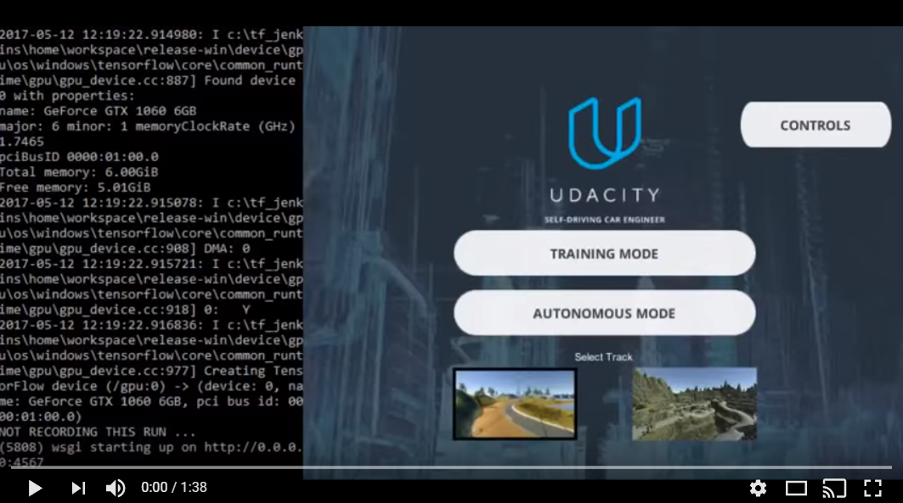

# **Behavioral Cloning Project**

The goals / steps of this project are the following:
* Use the simulator to collect data of good driving behavior
* Build, a convolution neural network in Keras that predicts steering angles from images
* Train and validate the model with a training and validation set
* Test that the model successfully drives around track one without leaving the road
* Summarize the results with a written report


[//]: # (Image References)

[centercam]: ./examples/center_drivingCounterClockwise.png "Center Camera"
[backwards]: ./examples/center_drivingClockwise.png "Center Camera - driving backwards"

## Rubric Points
### Here I will consider the [rubric points](https://review.udacity.com/#!/rubrics/432/view) individually and describe how I addressed each point in my implementation.  

---
### Files Submitted & Code Quality

#### 1. Submission includes all required files and can be used to run the simulator in autonomous mode

My project includes the following files:
* model.py containing the script to create and train the model
* drive.py for driving the car in autonomous mode
* model.h5 containing a trained convolution neural network 
* writeup_report.md (this file) summarizing the results

#### 2. Submission includes functional code
Using the Udacity provided simulator and my drive.py file, the car can be driven autonomously around the track by executing 
```sh
python drive.py model.h5
```

#### 3. Submission code is usable and readable

The model.py file contains the code for training and saving the convolution neural network. The file shows the pipeline I used for training and validating the model, and it contains comments to explain how the code works.

### Model Architecture and Training Strategy

#### 1. An appropriate model architecture has been employed

My model is based on the NVidia architecture because it did very well during initial testing (better than LeNet).

The structure consists of 5 convolutional layers of sizes 24, 36, 48, 64, and 64 in order. Then the model is flattened into four fully connected layers of size 100, 50, 10, and 1 - where the 1 output layer is the steering angle. (model.py lines 167-179).

In addition to the default NVidia layers, I've also added Dropout in between 3 of the last 4 convolutional layers. There are more details on Dropout in the next section.

#### 2. Attempts to reduce overfitting in the model

The model contains dropout layers in order to reduce overfitting.

The model was trained and validated on different data sets to ensure that the model was not overfitting. The model was tested by running it through the simulator and ensuring that the vehicle could stay on the track.

Adding dropout before the final layer lead to better (lower) validation loss, but it lead to worse performance on the actual track. The worse performance with Dropout before the last layer makes sense since having only one output layer means that dropout causes the input to be completely ignored).

The dropout layers are in model.py lines 174 and 176.

#### 3. Model parameter tuning

The model used an adam optimizer, so the learning rate was not tuned manually (model.py line 183).

#### 4. Appropriate training data

Training data was chosen to keep the vehicle driving on the road. I used a combination of center lane driving, driving the track in reverse (instead of augmenting by flipping images), recovering from the left and right sides of the road, and doing a few recovery passes at challenging areas of the track.

For details about how I created the training data, see the next section. 

### Model Architecture and Training Strategy

#### 1. Solution Design Approach

The overall strategy for deriving a model architecture was to start with known-architectures and evaluate their relative performance, then use several types of training, make my code efficient for fast-training, then tweak the system until the results were satisfactory.

My first step was to use a convolution neural network model similar to LeNet which is used in many computer-vision and classification problems.  I then compared these results to the results of an NVidia architecture and noticed that the car performed significantly better on the track using the NVidia architecture with a basic training set, so I chose to continue working with the NVidia architecture.

As I set up the environment, trained initial data (just 2 laps in each direction), and built the model, I kept a list of notes of things that I could do that seemed like they'd have a high level of efficacy for a low level of effort & code-complexity.  As I worked through the project, I just took items off of this list and measured their impact before evaluating what the model's remaining weaknesses were and deciding which improvements seemed likely to be the next most-effective improvement.  I also included a list of items that I thought would be helpful if the model stagnated, but would not be desirable otherwise (because they appeared to be high-effort, low-impact changes).  Fortunately, I was able to get the car to comfortably do laps around the track indefinitely, without pursuing any of the more messy changes.

Since the NVidia architecture was taking around 44 seconds per epoch of training and I know from past-projects that rapidly training, modifying, and re-training a network was valuable - I added an NVidia GTX 1060 graphics card to my system and reconfigured it to use the Tensorflow-GPU/cuDNN/CUDA stack to train the network (our Keras implementation was using Tensorflow under the hood). This lead to epochs being able to be trainined in about 7 seconds on the same size data.  Once this improvement was made, it also allowed me to add more training-data without fear of crippling the reasearch process.

In addition to adding a GPU to the training, I also used a generator which allowed loading portions of the dataset as-needed rather than loading the entire training set into memory at once.  When the training set was just 2 laps in each direction, the model.py script was already using about 2 gigs of memory just to train. When I switched to the generator, this allowed me to increase the dataset without being bound by available-memory on the machine.  In the end, my dataset ended up being probably twice as large.  See below for more information on the training data I used.

During training, in order to gauge how well the model was working, I split my image and steering angle data into a training and validation set.  I used 20% of the data for validating the results of validation and 80% for training.

The loss and validation loss were a good general indicator of when the model was over or under-fitting.  When the model progressed to better (lower) loss from epoch to epoch, but the validation-loss did NOT progress, it was clear that the model was overfitting and I added Dropout layers to compensate for this.  All of these changes were verified in the simulator.  One surprising situation was that I noticed I could train even further and get even lower validation-loss if I added dropout between the last two fully-connected layers - however this made the car drive off the track when I tested there. This shows the importance of verifying the results in a more realistic environment than just using validation data.  The root-cause of the issue seems to be that Dropout is a terrible idea before an output-layer with only 1 output. Logically: this model is then doing training which includes several rounds where the only output is 0's and this doesn't provide any benefit to the model's training and only serves as noise.

Once the results of the car were fairly good, the car still had two problem areas: the dirt-trap after the bridge, and the end of the steep right turn immediately following that area.  Presumably, this just means that I didn't sufficiently cover these two spots in my "recovery" laps, so I used additional training data to surmount these issues and the car now performs satisfactorily around the entire track. More information on the training set is in the next step.

#### 2. Creation of the Training Set & Training Process

To capture good driving behavior, I first recorded two laps on track one using center lane driving, in each direction.  After training my first lap, it was very obvious that there was a bias towards driving to the left (since this was a counter-clockwise lap) so I immediately decided to balance all of my laps with laps in the other direction (clockwise) and this seems to have managed the left-turn bias quite well. Here is an example image of center lane driving:

![Center camera][centercam]

Here is an example of driving clockwise (backwards) around the track, near the infamous "dirt-trap" near the bridge.

![Driving around the track in the other direction][backwards]

Later in Lesson 12, I learned that a common approach to solve the left-bias can be to augment the training data with mirror-images, but I found my approach of driving in reverse to work quite well, be very performant (I didn't need to do image modification every time I run the script) so I continued using my method.

The simulator car has 3 cameras mounted on it, and one way to add additional recover data could have been to modify the steering angle from each of the cameras to bias them towards the center. However, my training data was sufficient so I did not need to use these other images.  This kept my model training quite fast by using only 1/3 of the images.  If I had trouble, I would have used this augmentation, but I did not need to.

As I trained more info into my training-set, I kept a log of what I'd trained.  Unless otherwise noted, all of the training data was done at full-speed (30mph).  Early in the testing, I modified drive.py on line 47 to `set_speed=30` to make the car go faster. This made my test-laps much faster and it made the car less boring & closer to a speed that I percieved was a "realistic" speed for training a car to drive.  The controller does not allow the speed to go above 30mph (I tried that) so I left it at 30 which is also the max-speed when manually driving in the simulator.  Testing showed that my results were very similar for the default 9mph and for 30mph so I did the remainder of the project at this speed.

Here is the data in the final training set that I used. There were around 6,500 datapoints (rows in the .csv file):
#   Lap
#   Backwards Lap
#   Lap
#   Backwards Lap
#   Trained a bit near dirt-road tire-trap forward
#   Trained a bit near dirt-road tire-trap forward (9-10 mph)
#   Trained a bit near dirt-road tire-trap backwards (9-10 mph)
#   Trained recovery lap forward
#   Trained recovery lap backwards
#   Trained recovery near two bad spots (block after dirt trap & end of the next right turn) forward. About 3 approaches to each area.

Adding dropout between fully-connected layers generalized the network a bit and made the driving smoother. Adding the recovery training data made much of the driving a bit more wobbly, but made the car able to recover much better & not drive off the track.  The two trouble-areas probably were under-represented in my recovery-lap training (which consisted of me driving near an edge, then starting the recording, driving a "recovery" back to the center of a lane, then stopping-recordinge & saving the training data) so I added additional recovery near those two trouble-spots.

I used this training data for training the model. The validation set helped determine if the model was over or under fitting. The ideal number of epochs was around 5 as shown by testing various levels.  The validation-loss did NOT improve after 5 epochs. The only way I could prevent overfitting beyond that point was to add more dropout, but this resulted in worse performance on the actual track. I used an adam optimizer so that manually training the learning rate wasn't necessary.

In addition to the required video.mp4 (in this same github repo) of the car's center-camera I also made a video using OBS Multiplatform, showing the drive.py running next to the simulator in 3rd-person mode. Click the thumbnail below to view the video on YouTube.

[](https://www.youtube.com/watch?v=Y-hnSu9Gfls "Behavioral Cloning")
